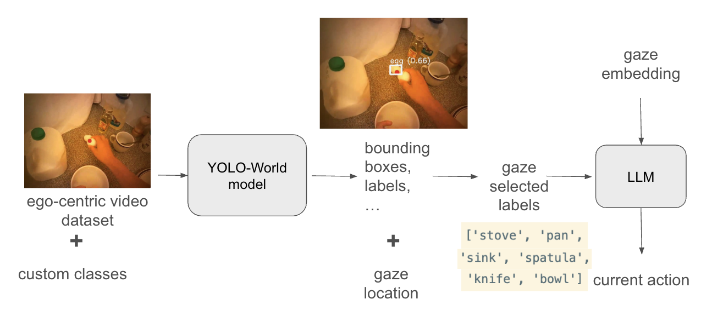

# Gaze-informed Object Sequences for Egocentric Action Recognition

This repository contains the implementation for the Master's thesis:

**"Gaze-informed Object Sequences for Egocentric Action Recognition using Deep Learning"**

The project investigates how human gaze behavior can be integrated with object-centric scene understanding to improve action recognition in egocentric videos.

Our approach extracts gaze-informed object token scanpaths from egocentric video frames and models them as temporal sequences for downstream action classification.

---

# Overview

Egocentric action recognition is challenging due to rapid camera motion, occlusions, and cluttered scenes.

Human gaze provides valuable information about **visual attention and task-relevant objects**. During everyday activities, people typically fixate on the objects they interact with.

This project makes use of gaze information to construct **gaze-informed object sequences**, which are then modeled as temporal sequences for action recognition.

---

# Pipeline


The experiments are conducted using the [**EGTEA Gaze+ dataset**](https://cbs.ic.gatech.edu/fpv/) to develop a two-stage action recognition pipeline:
* **Token Scanpath Generation**: Convert raw gaze data and video frames into structured object token sequences. This stage uses [**YOLO-World**](https://arxiv.org/pdf/2401.17270) (an open-vocabulary vision-language object detector) to perform open-vocabulary object detection.

* **Action Recognition**: Use temporal sequence modeling (e.g., BiGRU) to classify cooking activities based on the gaze-informed tokens generated in the previous stage.

---
# Getting Started
> ⚠️ Note: The codebase was last tested in **July 2025** during the experiments conducted for the thesis.  
> Some dependencies (e.g., YOLO-World from Ultralytics) may have been updated since then. Minor adjustments may be required to reproduce the experiments.

### 1. Environment Setup:
```bash
conda create -n gaze_action python=3.10
conda activate gaze_action
pip install -r requirements.txt
```

### 2. Dataset & Model Preparation
Download the **EGTEA Gaze+ dataset** and place it in a directory of your choice.

Example:
```
EGTEA_ROOT/
├── videos/
├── annotations/
├── gaze_data/
```

This path will be provided as an argument when running the pipeline.

For token scanpaths generation, we used the pre-trained YOLO-World model from Ultralytics. 

### 3. Run Pipeline
#### Generating Token Scanpaths

To generate gaze-informed object token sequences, run:
```python
python egtea/pipeline.py --root_path [YOUR ROOT PATH TO EGTEA DATASET]
```
This step:

- processes gaze fixation events
- extracts object tokens
- constructs token scanpaths for each action clip

#### Scanpath Similarity Analysis

To analyze the similarity between generated object token scanpaths, we compute pairwise similarity scores using the **Needleman–Wunsch sequence alignment algorithm** and visualize them as similarity matrices.

To analyse, run:
```python
python egtea/plot_similarity_matrix.py
```

This script generates visualizations similar to those presented in the thesis.


#### Training the Action Recognition Model
To train the sequence model, run:
```python
python egtea/classification.py
```
This script trains a BiGRU-based sequence classifier on the generated object token scanpaths.

#### Running Inference

To evaluate a trained model, run:
```python
python egtea/inference.py
```
This loads a trained model and predicts action labels for unseen token scanpaths in the test set.


# Results

We evaluate the proposed approach on subsets of the EGTEA Gaze+ dataset with different numbers of action classes. The classes are selected based on the number of available samples, using the **top-k most frequent classes** to avoid low-sample categories.

| #classes | mean acc | mean class acc |
|--------|--------|--------|
| top-2 | 76.44 ± 1.16 | 78.67 ± 1.06 |
| top-3 | 59.37 ± 1.38 | 54.64 ± 1.98 |
| top-4 | 53.49 ± 1.24 | 42.74 ± 1.27 |
| all (106 classes) | 8.58 ± 1.3 | 2.14 ± 0.67 |

As more classes with fewer training samples are included, classification performance drops significantly, highlighting the challenges of fine-grained egocentric action recognition and class imbalance in the full dataset.